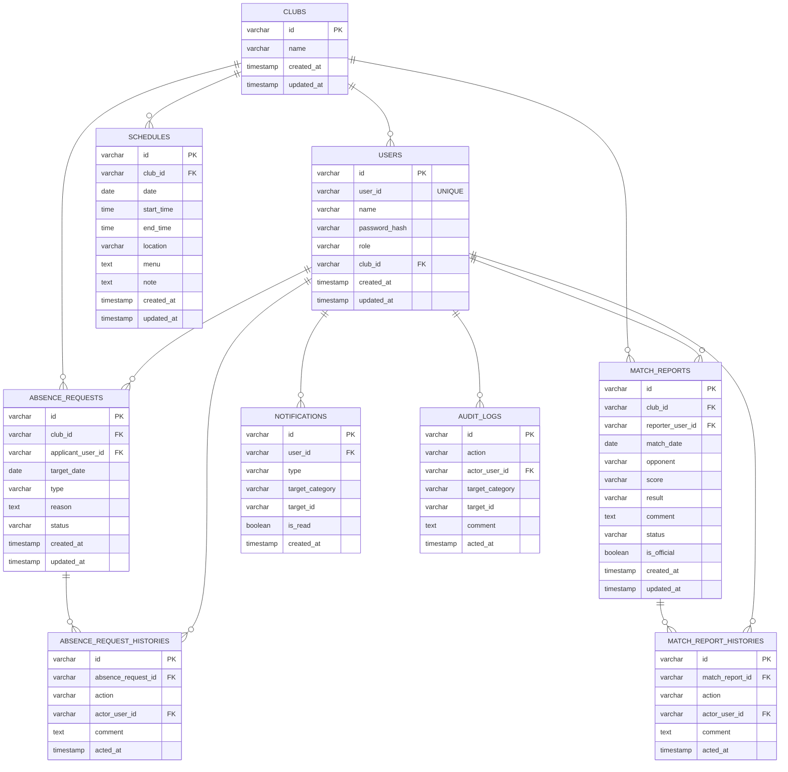

# DB設計書（フェーズ1 / MVP）

## 1. 本資料の目的

本資料は、部活動向け業務支援システムにおける  
データベース設計（テーブル構成・カラム定義・制約・インデックス）を定義することを目的とする。

本資料はフェーズ1（MVP）を対象とする。

---

## 2. 設計方針

- データは部活動単位で分離する
- 状態遷移はDBで整合性が取れる構造とする
- 証跡は履歴テーブルで保持する
- 監査ログは追記専用（INSERT ONLY）
- 論理削除は原則使用しない
- 主キーはUUID（varchar(36)）とする
- すべての主要テーブルに created_at / updated_at を持たせる

---

# 3. ER概要

---

# 4. テーブル定義

---

## 4.1 clubs（部活動）

| カラム名 | 型 | 必須 | 説明 |
|----------|----|------|------|
| id | varchar(36) | ○ | 部活動ID（PK） |
| name | varchar(100) | ○ | 部活動名 |
| created_at | timestamp | ○ | 作成日時 |
| updated_at | timestamp | ○ | 更新日時 |

**PK**
- id

---

## 4.2 users（ユーザー）

| カラム名 | 型 | 必須 | 説明 |
|----------|----|------|------|
| id | varchar(36) | ○ | ユーザーID（PK） |
| user_id | varchar(50) | ○ | ログインID（UNIQUE） |
| name | varchar(100) | ○ | 氏名 |
| password_hash | varchar(255) | ○ | パスワード（ハッシュ） |
| role | varchar(20) | ○ | STUDENT / COACH / ADMIN |
| club_id | varchar(36) | ○ | 所属クラブ |
| created_at | timestamp | ○ | 作成日時 |
| updated_at | timestamp | ○ | 更新日時 |

**PK**
- id

**FK**
- club_id → clubs.id

**UNIQUE**
- user_id

**INDEX**
- idx_users_club

---

## 4.3 absence_requests（欠席申請）

| カラム名 | 型 | 必須 | 説明 |
|----------|----|------|------|
| id | varchar(36) | ○ | 申請ID（PK） |
| club_id | varchar(36) | ○ | 部活動ID |
| applicant_user_id | varchar(36) | ○ | 申請者 |
| target_date | date | ○ | 対象日 |
| type | varchar(20) | ○ | ABSENCE / LATE / EARLY_LEAVE / NOT_PARTICIPATE |
| reason | text | ○ | 理由 |
| status | varchar(20) | ○ | DRAFT / SUBMITTED / RETURNED / APPROVED / REJECTED / CANCELLED |
| created_at | timestamp | ○ | 作成日時 |
| updated_at | timestamp | ○ | 更新日時 |

**PK**
- id

**FK**
- club_id → clubs.id
- applicant_user_id → users.id

**INDEX**
- idx_absence_club
- idx_absence_status
- idx_absence_target_date

---

## 4.4 absence_request_histories（欠席申請履歴）

| カラム名 | 型 | 必須 | 説明 |
|----------|----|------|------|
| id | varchar(36) | ○ | 履歴ID（PK） |
| absence_request_id | varchar(36) | ○ | 対象申請 |
| action | varchar(20) | ○ | SUBMIT / APPROVE / RETURN / REJECT / CANCEL |
| actor_user_id | varchar(36) | ○ | 操作者 |
| comment | text | 任意 | コメント |
| acted_at | timestamp | ○ | 操作日時 |

**PK**
- id

**FK**
- absence_request_id → absence_requests.id
- actor_user_id → users.id

**INDEX**
- idx_absence_history_request

---

## 4.5 match_reports（試合結果報告）

| カラム名 | 型 | 必須 | 説明 |
|----------|----|------|------|
| id | varchar(36) | ○ | 報告ID（PK） |
| club_id | varchar(36) | ○ | 部活動ID |
| reporter_user_id | varchar(36) | ○ | 作成者 |
| match_date | date | ○ | 試合日 |
| opponent | varchar(200) | ○ | 対戦相手 |
| score | varchar(100) | ○ | スコア |
| result | varchar(10) | ○ | WIN / LOSE / DRAW |
| comment | text | 任意 | コメント |
| status | varchar(20) | ○ | DRAFT / SUBMITTED / RETURNED / APPROVED / REJECTED / CANCELLED |
| is_official | boolean | ○ | 公式記録フラグ |
| created_at | timestamp | ○ | 作成日時 |
| updated_at | timestamp | ○ | 更新日時 |

**PK**
- id

**FK**
- club_id → clubs.id
- reporter_user_id → users.id

**INDEX**
- idx_match_club
- idx_match_status
- idx_match_date

---

## 4.6 match_report_histories（試合結果履歴）

| カラム名 | 型 | 必須 | 説明 |
|----------|----|------|------|
| id | varchar(36) | ○ | 履歴ID（PK） |
| match_report_id | varchar(36) | ○ | 対象報告 |
| action | varchar(20) | ○ | SUBMIT / APPROVE / RETURN / REJECT / CANCEL |
| actor_user_id | varchar(36) | ○ | 操作者 |
| comment | text | 任意 | コメント |
| acted_at | timestamp | ○ | 操作日時 |

**PK**
- id

**FK**
- match_report_id → match_reports.id
- actor_user_id → users.id

**INDEX**
- idx_match_history_report

---

## 4.7 schedules（練習スケジュール）

| カラム名 | 型 | 必須 | 説明 |
|----------|----|------|------|
| id | varchar(36) | ○ | スケジュールID（PK） |
| club_id | varchar(36) | ○ | 部活動ID |
| date | date | ○ | 日付 |
| start_time | time | 任意 | 開始時刻 |
| end_time | time | 任意 | 終了時刻 |
| location | varchar(200) | ○ | 場所 |
| menu | text | 任意 | 内容 |
| note | text | 任意 | 備考 |
| created_at | timestamp | ○ | 作成日時 |
| updated_at | timestamp | ○ | 更新日時 |

**PK**
- id

**FK**
- club_id → clubs.id

**INDEX**
- idx_schedule_club
- idx_schedule_date

---

## 4.8 notifications（通知）

| カラム名 | 型 | 必須 | 説明 |
|----------|----|------|------|
| id | varchar(36) | ○ | 通知ID（PK） |
| user_id | varchar(36) | ○ | 通知対象 |
| type | varchar(50) | ○ | 通知種別 |
| target_category | varchar(20) | ○ | ABSENCE / MATCH |
| target_id | varchar(36) | ○ | 対象ID |
| is_read | boolean | ○ | 既読フラグ |
| created_at | timestamp | ○ | 作成日時 |

**PK**
- id

**FK**
- user_id → users.id

**INDEX**
- idx_notification_user
- idx_notification_read

---

## 4.9 audit_logs（監査ログ）

| カラム名 | 型 | 必須 | 説明 |
|----------|----|------|------|
| id | varchar(36) | ○ | 監査ログID（PK） |
| action | varchar(50) | ○ | 操作種別 |
| actor_user_id | varchar(36) | ○ | 操作者 |
| target_category | varchar(20) | ○ | 対象種別 |
| target_id | varchar(36) | ○ | 対象ID |
| comment | text | 任意 | コメント |
| acted_at | timestamp | ○ | 操作日時 |

**PK**
- id

**FK**
- actor_user_id → users.id

**INDEX**
- idx_audit_actor
- idx_audit_target
- idx_audit_acted_at

---

# 5. 状態整合性ルール

- absence_requests.status の変更は履歴テーブルと同一トランザクションで処理する
- match_reports.status の変更も同様に処理する
- APPROVED時のみ is_official = true に更新する
- 不正な状態遷移はアプリケーション側で拒否する（409 Conflict）

---

# 6. 排他制御方針

- 楽観ロック（updated_atの比較）を想定
- 状態変更時は最新更新日時を確認する

---

# 7. マイグレーション管理

- Flywayを使用する
- V1__init.sql で初期テーブル作成
- 以降はバージョン管理でDDL変更を管理する
